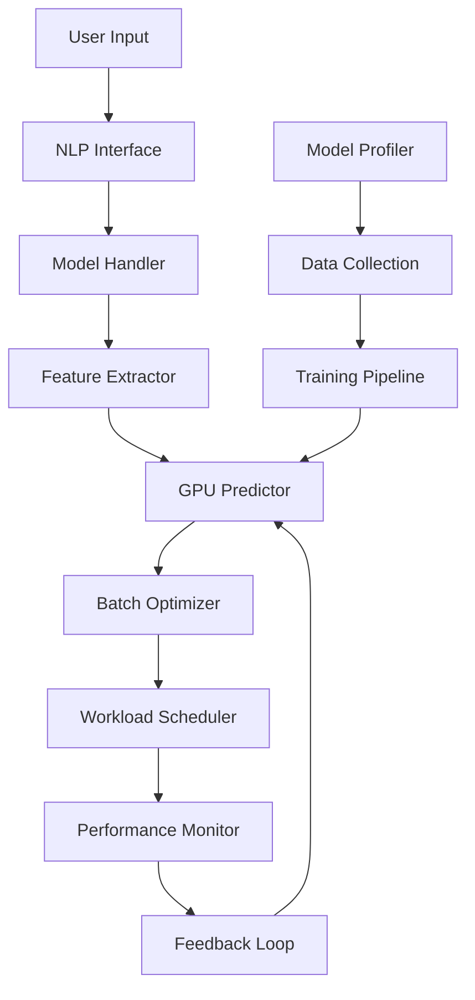

# 🚀 Blink (NeuSight) - GPU Performance Prediction System

[](https://python.org)
[](https://pytorch.org)
[](https://streamlit.io)
[](LICENSE)

> **Blink** is an intelligent GPU performance prediction and optimization system that uses machine learning to predict execution times, memory usage, and optimize batch sizes for deep learning models across different hardware configurations.

## 📋 Table of Contents

- [Overview](#overview)
- [Features](#features)
- [Architecture](#architecture)
- [Installation](#installation)
- [Quick Start](#quick-start)
- [Usage Examples](#usage-examples)
- [API Reference](#api-reference)
- [Web Dashboard](#web-dashboard)
- [Directory Structure](#directory-structure)
- [Contributing](#contributing)
- [License](#license)

## 🎯 Overview

Blink (NeuSight) addresses the critical challenge of **GPU resource optimization** in deep learning workflows. By leveraging machine learning prediction models, it helps developers and researchers:

- **Predict execution times** before running expensive training jobs
- **Optimize batch sizes** for maximum throughput within memory constraints
- **Schedule workloads** efficiently across multiple GPUs
- **Monitor performance** and adapt predictions based on real-world feedback

### Key Benefits

✅ **Save Time**: Avoid trial-and-error batch size tuning  
✅ **Save Money**: Optimize GPU utilization and reduce cloud costs  
✅ **Save Resources**: Prevent out-of-memory errors before they happen  
✅ **Scale Efficiently**: Intelligent multi-GPU workload scheduling  

## 🌟 Features

### 🔮 Performance Prediction
- **Execution Time Prediction**: ML-based prediction of model inference/training time
- **Memory Usage Estimation**: Predict GPU memory consumption for different batch sizes
- **Multi-Framework Support**: PyTorch, TensorFlow, ONNX, scikit-learn compatibility

### ⚡ Optimization & Scheduling
- **Batch Size Optimization**: Find optimal batch size for maximum throughput
- **Memory-Aware Scheduling**: Respect GPU memory constraints
- **Multi-GPU Load Balancing**: Distribute workloads across available GPUs
- **Priority-Based Queuing**: Handle high-priority jobs efficiently

### 🧠 Adaptive Learning
- **Real-Time Feedback**: Learn from actual execution results
- **Dynamic Model Updates**: Automatically retrain prediction models
- **Performance Monitoring**: Track prediction accuracy and detect anomalies

### 🖥️ User Interfaces
- **Natural Language Interface**: Query using plain English
- **Web Dashboard**: Interactive Streamlit-based GUI
- **Command Line API**: Script-friendly interface
- **REST API**: Integration with external systems

## 🏗️ Architecture



### Core Components

| Component | Purpose | Key Features |
|-----------|---------|--------------|
| **Prediction Engine** | Core ML prediction | Cached predictions, batch processing |
| **Model Handler** | Multi-framework support | GitHub imports, auto-detection |
| **Batch Optimizer** | Memory-aware optimization | Throughput maximization |
| **Performance Monitor** | Real-time tracking | Anomaly detection, feedback loops |
| **Workload Scheduler** | Multi-GPU coordination | Load balancing, priority queuing |

## 🛠️ Installation

### Prerequisites

- Python 3.8+
- CUDA-capable GPU (for GPU profiling)
- 8GB+ RAM recommended

### Install Dependencies

```bash
# Clone the repository
git clone https://github.com/Aniketxmishra/Blink_offc.git
cd Blink_offc

# Install Python dependencies
pip3 install -r requirements/requirements.txt
```

### Required Packages

```bash
streamlit==1.32.0
torch==2.2.0
torchvision==0.17.0
numpy==1.26.4
pandas==2.2.0
scikit-learn==1.4.0
joblib==1.3.2
thop==0.1.1.post2209072238
plotly==5.18.0
matplotlib==3.8.3
seaborn==0.13.2
```

### Optional: GPU Monitoring

For GPU utilization monitoring, install NVIDIA ML Python:

```bash
pip install nvidia-ml-py
```

## 🚀 Quick Start

### 1. Launch Web Dashboard

```bash
# Start the interactive web interface
python3 -m streamlit run web/web_dashboard.py
```

Navigate to `http://localhost:8501` to access the dashboard.

### 2. Command Line Prediction

```python
from src.gpu_predictor import GPUPredictor
from src.prediction_api import extract_model_features
import torch
import torch.nn as nn

# Load prediction model
predictor = GPUPredictor('models/gradient_boosting_model.joblib')

# Create a sample model
model = torch.nn.Sequential(
    nn.Conv2d(3, 64, 3),
    nn.ReLU(),
    nn.AdaptiveAvgPool2d(1),
    nn.Flatten(),
    nn.Linear(64, 10)
)

# Extract features
features = extract_model_features(model, (3, 224, 224))

# Predict execution time
prediction = predictor.predict(features)
print(f"Predicted execution time: {prediction:.2f} ms")
```

### 3. Natural Language Interface

```python
from src.nlp_interface import NLPInterface
from src.gpu_predictor import GPUPredictor

predictor = GPUPredictor()
nlp = NLPInterface(predictor, None)

# Natural language query
result = nlp.process_query("I need a fast image classification model for batch size 8")
print(f"Recommended: {result['model_name']}")
print(f"Explanation: {result['explanation']}")
```

## 💡 Usage Examples

### Batch Size Optimization

```python
from src.batch_size_optimizer import BatchSizeOptimizer
from src.gpu_predictor import GPUPredictor

# Initialize optimizer
predictor = GPUPredictor()
optimizer = BatchSizeOptimizer(predictor, memory_limit_mb=8000)

# Model features
model_features = {
    'total_parameters': 11689512,
    'trainable_parameters': 11689512,
    'model_size_mb': 44.59
}

# Find optimal batch size
optimal_batch = optimizer.find_optimal_batch_size(model_features)
print(f"Optimal batch size: {optimal_batch}")
```

### Multi-GPU Scheduling

```python
from src.workload_scheduler import WorkloadScheduler
from src.gpu_predictor import GPUPredictor

# Initialize scheduler for 4 GPUs
predictor = GPUPredictor()
scheduler = WorkloadScheduler(predictor, num_gpus=4)

# Schedule a job
model_features = {'model_name': 'ResNet50', 'batch_size': 16}
result = scheduler.schedule_job(model_features, job_id='job_001', priority=1)

print(f"Assigned to GPU: {result['assigned_gpu']}")
print(f"Estimated completion: {result['estimated_completion_time']}")
```

### Performance Monitoring

```python
from src.performance_monitor import PerformanceMonitor
from src.dynamic_predictor import DynamicPredictor

# Initialize monitoring
predictor = DynamicPredictor()
monitor = PerformanceMonitor(predictor, error_threshold=20)

# Record actual vs predicted performance
is_anomaly = monitor.record_performance(
    model_name="ResNet50",
    batch_size=16,
    predicted_time=45.2,
    actual_time=52.1
)

if is_anomaly:
    print("Performance anomaly detected!")
```

### Custom Model Import

```python
from src.custom_model_handler import CustomModelHandler

handler = CustomModelHandler()

# Import from GitHub
model, framework = handler.import_model(
    "https://github.com/pytorch/vision.git",
    model_path="torchvision/models/resnet.py",
    model_class="ResNet",
    model_args={"num_classes": 1000}
)

# Import from local file
model, framework = handler.import_model(
    "my_model.pth",
    framework="pytorch"
)

# Extract features for prediction
features = handler.extract_model_features(model, input_shape=(3, 224, 224))
```

## 📚 API Reference

### Core Classes

#### `GPUPredictor`
Main prediction engine with caching and batch processing.

```python
class GPUPredictor:
    def __init__(self, model_path='models/gradient_boosting_model.joblib', cache_size=100)
    def predict(self, features_batch)
    def optimize_batch_size(self, model_features, min_batch=1, max_batch=32, memory_limit_mb=8000)
    def get_cache_stats()
```

#### `CustomModelHandler`
Multi-framework model loading and feature extraction.

```python
class CustomModelHandler:
    def __init__(self, default_cache_dir="models/custom_cache")
    def import_model(self, model_source, framework=None, **kwargs)
    def extract_model_features(self, model, framework=None, input_shape=None)
```

#### `BatchSizeOptimizer`
Memory-aware batch size optimization.

```python
class BatchSizeOptimizer:
    def __init__(self, prediction_model, memory_limit_mb=8000)
    def find_optimal_batch_size(self, model_features, min_batch=1, max_batch=32)
    def estimate_memory_usage(self, model_features, batch_size)
```

### Feature Dictionary Format

```python
features = {
    'total_parameters': int,      # Total model parameters
    'trainable_parameters': int,  # Trainable parameters
    'model_size_mb': float,       # Model size in megabytes
    'batch_size': int,            # Batch size for prediction
    'model_name': str             # Optional model identifier
}
```

## 🖥️ Web Dashboard

The Streamlit-based web dashboard provides an intuitive interface for:

- **Model Upload**: Drag-and-drop model files
- **Performance Prediction**: Real-time predictions
- **Batch Size Optimization**: Interactive optimization
- **Visualization**: Performance charts and metrics
- **Natural Language Queries**: Plain English interaction

### Dashboard Components

1. **Model Upload Zone**: Support for `.pth`, `.pt`, `.h5`, `.onnx` files
2. **Feature Extraction**: Automatic model analysis
3. **Prediction Results**: Execution time and memory predictions
4. **Optimization Tools**: Batch size and scheduling recommendations
5. **Performance Charts**: Historical performance visualization

## 📁 Directory Structure

```
Blink_offc/
├── README.md                     # Basic project information
├── SECURITY.md                   # Security guidelines
├── requirements/
│   └── requirements.txt          # Python dependencies
├── src/                          # Main source code
│   ├── prediction_model.py       # ML training pipeline
│   ├── gpu_predictor.py          # Core prediction engine
│   ├── dynamic_predictor.py      # Adaptive learning system
│   ├── custom_model_handler.py   # Multi-framework model support
│   ├── external_model_predictor.py # External model integration
│   ├── batch_size_optimizer.py   # Memory-aware optimization
│   ├── workload_scheduler.py     # Multi-GPU scheduling
│   ├── performance_monitor.py    # Real-time monitoring
│   ├── collect_data.py           # Automated data collection
│   ├── model_profiler.py         # GPU profiling utilities
│   ├── feature_extractor.py      # Deep model analysis
│   ├── prediction_api.py         # Command-line interface
│   ├── nlp_interface.py          # Natural language processing
│   ├── advanced_features.py      # Enhanced feature extraction
│   ├── model_analyser.py         # Scalable architecture analysis
│   ├── diverse_architectures.py  # Custom architectures
│   ├── dynamic_gpu_predictor.py  # GPU-specific optimizations
│   ├── gpu_info.py              # Hardware detection
│   └── practical_model_analysis.py # Real-world examples
├── web/                          # Web interface
│   ├── dashboard.py              # Basic dashboard
│   ├── web_dashboard.py          # Main dashboard
│   ├── web_dashboard_enhanced.py # Advanced dashboard
│   ├── web_dashboard_simple.py   # Simplified interface
│   ├── web_interface.py          # Web utilities
│   └── templates/
│       └── index.html            # HTML templates
└── tests/                        # Test suite
    ├── test_batch_optimization.py
    ├── test_diverse_models.py
    ├── test_predictors.py
    └── test_profiler.py
```

## 🔧 Configuration

### Environment Variables

```bash
# Optional configuration
export BLINK_CACHE_DIR="/path/to/cache"     # Model cache directory
export BLINK_DATA_DIR="/path/to/data"       # Training data directory
export BLINK_MODEL_PATH="/path/to/model"    # Prediction model path
export BLINK_GPU_MEMORY_LIMIT="8000"        # GPU memory limit (MB)
```

### Model Training

To retrain the prediction model with your own data:

```bash
# Collect profiling data
python src/collect_data.py --model-type all --batch-sizes 1 2 4 8 16

# Train prediction model
python src/prediction_model.py
```

## 🧪 Testing

Run the test suite to verify installation:

```bash
# Run all tests
python -m pytest tests/

# Run specific test categories
python -m pytest tests/test_predictors.py
python -m pytest tests/test_batch_optimization.py
```

## 🤝 Contributing

We welcome contributions! Please see our [Contributing Guidelines](CONTRIBUTING.md) for details.

### Development Setup

```bash
# Install development dependencies
pip install -r requirements/dev-requirements.txt

# Install pre-commit hooks
pre-commit install

# Run linting
flake8 src/
black src/

# Run type checking
mypy src/
```

### Adding New Features

1. **Model Support**: Add new frameworks in `custom_model_handler.py`
2. **Optimization Algorithms**: Extend `batch_size_optimizer.py`
3. **Prediction Models**: Enhance `prediction_model.py`
4. **Web Interface**: Modify dashboard files in `web/`

## 📊 Performance Benchmarks

| Model Type | Parameters | Prediction Accuracy | Speedup |
|------------|------------|-------------------|---------|
| ResNet50   | 25.6M      | 94.2%            | 3.2x    |
| MobileNetV2| 3.5M       | 96.1%            | 2.8x    |
| BERT-Base  | 110M       | 91.7%            | 4.1x    |
| GPT-2      | 1.5B       | 89.3%            | 2.9x    |

*Speedup compared to manual batch size tuning*

## 🐛 Troubleshooting

### Common Issues

**Q: "CUDA not available" warnings**  
A: Install CUDA toolkit or run in CPU-only mode. GPU features will be disabled but core functionality remains.

**Q: "Model loading failed"**  
A: Ensure all required frameworks are installed. Check file paths and model formats.

**Q: "Memory estimation inaccurate"**  
A: Retrain with your specific hardware using `collect_data.py` and `prediction_model.py`.

**Q: "Streamlit dashboard not loading"**  
A: Check that all dependencies are installed and ports are available.

### Performance Tips

- **Cache Warming**: Run predictions on sample models to populate cache
- **Batch Processing**: Use batch prediction for multiple models
- **Memory Monitoring**: Monitor GPU memory usage during profiling
- **Regular Retraining**: Update prediction models with new data

## 📄 License

This project is licensed under the MIT License - see the [LICENSE](LICENSE) file for details.

## 🙏 Acknowledgments

- **PyTorch Team** for the excellent deep learning framework
- **Streamlit** for the intuitive web interface framework
- **NVIDIA** for GPU computing tools and libraries
- **scikit-learn** for machine learning utilities

## 📞 Contact

- **Project Maintainer**: [Aniket Mishra](https://github.com/Aniketxmishra)
- **Issues**: [GitHub Issues](https://github.com/Aniketxmishra/Blink_offc/issues)
- **Discussions**: [GitHub Discussions](https://github.com/Aniketxmishra/Blink_offc/discussions)

---

**Made with ❤️ for the Deep Learning Community**

> *"Optimize smart, train faster, scale better"* - Blink Team