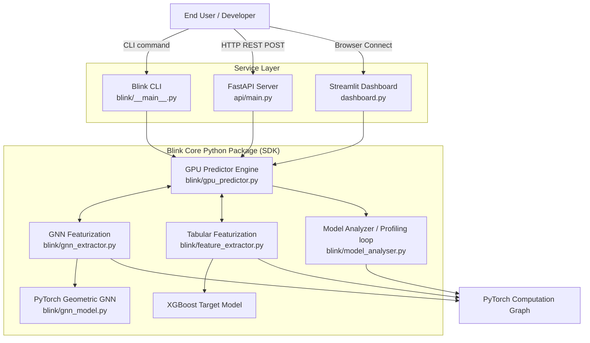

# PHASE 1 — Codebase Inventory & High-Level Architecture

## 1. Codebase Inventory

### Root Files
| File / Directory | Description |
|------------------|-------------|
| `README.md` | Primary project documentation. |
| `Dockerfile` & `Dockerfile.cpu` | Docker configurations for building the project with GPU support and CPU fallback. |
| `docker-compose.yml` | Multi-service compose file mapping Streamlit UI and FastAPI endpoints to their respective Docker containers with NVIDIA GPU reservation. |
| `pyproject.toml` | Unified project metadata, dependency definition, tool configuration, and entry points definition (`blink` and `blink-server`). |
| `requirements.txt` | Raw list of Python dependencies (used mainly inside Docker layers to leverage caching prior to pyproject installation). |
| `dashboard.py` | Front-end interactive Streamlit telemetry application showing the prediction engine state, features, and model benchmarks. |

### `/api` (REST API Server)
| File | Description |
|------|-------------|
| `main.py` | The main FastAPI server application exposing REST endpoints for prediction and batch size optimization (`/predict`, `/optimize`, `/health`). |
| `schemas.py` | Pydantic data models for strictly validating API requests and response formats (e.g., `PredictRequest`, `OptimizeResponse`, `ModelFeatures`). |

### `/blink` (Core Library)
| File | Description |
|------|-------------|
| `__main__.py` | CLI entry point definition acting as the dispatcher for `blink` and `blink-server` terminal commands. |
| `feature_extractor.py` | Extracts high-level tabular features (parameters size, activations, convolution depth, resolution) from PyTorch deep learning models. |
| `gnn_extractor.py` | Traverses a given PyTorch model computation graph and generates Nodes/Edges structure mapping for the Graph Neural Network pipeline. |
| `gnn_model.py` | Implements the hybrid Graph Convolutional Network / Graph Attention Network (GCN/GAT) model taking the `gnn_extractor` structures. |
| `gpu_predictor.py` | Main orchestrator class (`GPUPredictor`) that unifies the GNN graph features and the base XGBoost tabular features into memory and latency inference predictions. |
| `model_analyser.py` | Benchmarking orchestrator executing test loops for extracting live parameter bounds and hardware statistics via FLOPs counters like `thop`. |
| `_analyzer.py` & `_predictor.py` | Internal utility bridging modules that segment some of the codebase's profiler capabilities logic internally. |

### `/scripts` (Data Engineering, Automation & Explanations)
| File | Description |
|------|-------------|
| `ablation_study.py` | Automation script for dropping targeted ML model features recursively to test robustness and the resulting latency effects. |
| `collect_data.py` & `enhance_dataset.py` | Automated data collection routines constructing the initial raw datasets representing differing model permutations to train the prediction engines. |
| `diverse_architectures.py` | Evaluates models from disparate structural architectural paths (ResNet, GPT, EfficientNet) to build a wide ML spectrum. |
| `generate_paper_figures.py` / `*_tables.py` | Scripts targeted toward scientific publishing that generate reproducible PNG graphs and tables reflecting model accuracy and OOD generalization bounds. |
| `shap_explainer.py` | Implements the SHapley Additive exPlanations logic to decompose the models decisions to the dashboard interface to generate visual charts. |

### `/tests` (PyTest Suite)
| File | Description |
|------|-------------|
| `test_main.py` | Unittests specifically evaluating the FastAPI HTTP routing and payload mechanics. |
| `test_gnn_model.py` & `test_feature_extractor.py` | Evaluators ensuring the feature vector dimensions, graph edge sizes, and the core hybrid ML engine maintain integrity over code refactoring. |

### `.github/workflows` (CI/CD Pipeline)
| File | Description |
|------|-------------|
| `ci.yml` & `blink_pr_check.yml` | GitHub actions implementing code linting (via Ruff/Black), PyTest bounds verification, and standard quality checks on PR events. |
| `publish.yml` | Deployment triggers used for bumping versions on PyPI repository. |

---

## 2. High-Level Architecture Diagram
The architecture is divided conceptually into 4 pillars: the Core Library (`blink`), the REST API layer, the Visual UI Dashboard layer, and the underlying Dev/Research Scripts. 

---

## 3. External Dependencies & Reasoning
Below is the definitive list of dependencies imported either via system packages or defined within `pyproject.toml`.

| Dependency | Category | Role in Blink |
|------------|----------|---------------|
| `torch` / `torchvision` | Core Engine | Loading input models, capturing traces of computation graphs, running inferences, and acting as the host ML library. |
| `torch-geometric` | ML Pipeline | Constructing and maintaining the GCN/GAT architectural graph structures out of the pytorch graph arrays. |
| `xgboost` / `lightgbm` / `scikit-learn` | Tabular Engine | Used by the predictive block side-by-side with GNN representations to resolve rapid execution time matrices (Gradient Boosted Trees). |
| `thop` | Profiler | Calculates raw Mac(Multiple-Accumulate operations) and FLOPs dynamically at runtime over the generated Model Analyzer blocks. |
| `pynvml` | Hardware | Communicates directly to Nvidia GPU drivers allowing dynamic reads of current memory use without spawning parallel OS kernel requests. |
| `shap` | Interpretability | Required to extract feature dominance trees indicating whether "memory_bandwidth", "batch_size", or "GNN layers" is the largest constraint on inference times. |
| `fastapi` / `uvicorn` / `python-multipart` | Protocol Base | Runs the Async REST API responding dynamically to incoming network payloads for prediction bounds, optimization curves. |
| `streamlit` / `plotly` / `matplotlib` / `seaborn`| UI Layer | Building the internal `dashboard.py` interfaces with reactive plots allowing researchers to verify feature influences. |
| `pytest` / `pytest-cov` / `ruff` / `black` | Development | Enforcing static code checks, validating PyTest CI coverage rates, catching formatting exceptions. |

---

## 4. Environment Variables, Configs & Secrets

Blink does not utilize a rigid `.env` file for runtime secrets (largely because it doesn't hook into an external database nor requires complex managed integrations). All configuration variables remain encapsulated inside `docker-compose.yml`, `pyproject.toml`, or OS defaults.

**Key Environment Variables (`docker-compose.yml` / `Dockerfile`)**:
* `STREAMLIT_SERVER_HEADLESS=true`: Ensures that no browser spawn mechanisms break the generic OS execution hooks (which happens frequently inside Linux).
* `STREAMLIT_SERVER_PORT=8501`: Pre-locks Streamlit mapping port.
* `STREAMLIT_BROWSER_GATHER_USAGE_STATS=false`: Protects telemetry offloading allowing corporate networks to execute `blink` safely offline.
* `STREAMLIT_SERVER_ENABLE_CORS=false`: Enables wider external requests mapping.

**Config Files**:
* `pyproject.toml` - Defacto environment definition file encoding testing paths, API markers, tool arguments, metadata schemas defining versions, project requirements lists depending on `[full,api,gnn,explain,dev]` install flags.

_End of Phase 1._
